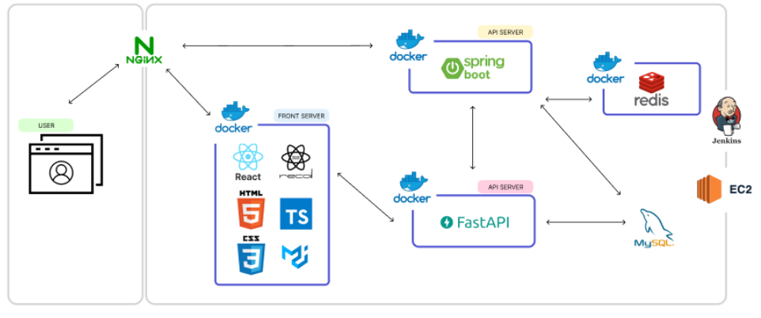

<div align="center">
  
</div>

<br/>

<div align="center">
  <h1>BookWave</h1> 
  
수많은 책들 사이에서 어떤 책을 읽어야할 지 감이 잡히지 않을 때,

베스트 셀러 추천이 아닌 색다른 기준으로 추천 받고 싶을 때,

다양하게 느끼는 감정들을 기록하고 공유하고 싶을 때, 

저희는 이와 같은 상황을 위해 “북웨이브” 서비스를 고안했습니다.
</div>

<br>


## 👪 개발 멤버 소개

<table> <tr> <td height="120px" align="center"> <a href="https://github.com/sseq007">  <br><br> 👑 신준호 <br>(BackEnd)<br/>(Infra) </a> <br></td> <td height="140px" align="center"> <a href="https://github.com/choijehyuk">  <br><br> 😆 최제혁 <br>(BackEnd) </a> <br></td> <td height="140px" align="center"> <a href="https://github.com/Sohyun043011">  <br><br> 😶 박소현 <br>(FullStack) </a> <br></td> <td height="140px" align="center"> <a href="https://github.com/mxnzx">  <br><br> 🙄 류민지 <br>(BackEnd)<br/>(Infra) </a> <br></td> <td height="140px" align="center"> <a href="https://github.com/dubu777">  <br><br> 😁 원재현 <br>(FrontEnd) </a> <br></td> <td height="140px" align="center"> <a href="https://github.com/SeongLI">  <br><br> 🙂 이은성 <br>(FrontEnd) </a> <br></td> </tr> 
</table>

<br />

## 📆 프로젝트 기간

### 23.08.21. ~ 23.10.06

<br />

## 🗂️ 프로젝트 구성

<details>
<summary>FE 폴더 구조</summary>

```Plain Text
.
├── App.tsx
├── apis
│   ├── Book
│   │   └── book.ts
│   ├── Feed
│   │   ├── bbti.ts
│   │   ├── bookList.ts
│   │   ├── recode.ts
│   │   └── userInfo.ts
│   ├── Reminder
│   │   └── diary.ts
│   ├── auth.ts
│   ├── bbti.ts
│   ├── book.ts
│   ├── index.ts
│   ├── member.ts
│   ├── memorize.ts
│   └── recommend.ts
├── assets
│   ├── Images
│   │   ├── Feed
│   │   │   ├── Reminder_1.png
│   │   │   ├── Reminder_2.png
│   │   │   ├── Reminder_3.png
│   │   │   └── Reminder_4.png
│   │   ├── TempImage.jpg
│   │   ├── bbtibook.png
│   │   ├── bookshelf.jpg
│   │   ├── community1.jpg
│   │   ├── community2.jpg
│   │   ├── feed.jpg
│   │   ├── feed_2.jpg
│   │   ├── guestrecommendlg.jpg
│   │   ├── guestrecommendmd.jpg
│   │   ├── hamzzi.png
│   │   ├── hamzzi2.jpg
│   │   ├── logo.png
│   │   ├── profile2.png
│   │   ├── recommend.jpg
│   │   ├── recommend3.png
│   │   ├── record.jpg
│   │   ├── 민지.JPG
│   │   ├── 재현.JPG
│   │   ├── 준호.jpeg
│   │   ├── 소현.jpg
│   │   └── 제혁.jpg
│   ├── font
│   │   ├── AppleSDGothicNeoB.ttf
│   │   ├── AppleSDGothicNeoEB.ttf
│   │   ├── AppleSDGothicNeoH.ttf
│   │   ├── AppleSDGothicNeoL.ttf
│   │   ├── AppleSDGothicNeoM.ttf
│   │   ├── AppleSDGothicNeoR.ttf
│   │   ├── AppleSDGothicNeoSB.ttf
│   │   ├── AppleSDGothicNeoT.ttf
│   │   ├── AppleSDGothicNeoUL.ttf
│   │   ├── SF-Pro-Text-Bold.otf
│   │   ├── SF-Pro-Text-Heavy.otf
│   │   ├── SUITE-Bold.ttf
│   │   ├── SUITE-Regular.ttf
│   │   ├── Yeongdeok Blueroad.ttf
│   │   └── font.css
│   ├── icons
│   │   ├── Book.png
│   │   ├── CarouselLeft.png
│   │   ├── CarouselRight.png
│   │   ├── Comment.png
│   │   ├── Drop.png
│   │   ├── FeedPlus.png
│   │   ├── FeedSearch.png
│   │   ├── Like.png
│   │   ├── LikeFull.png
│   │   ├── Remove.png
│   │   ├── Update.png
│   │   ├── Upload.png
│   │   ├── arrow-forward-circle-outline.png
│   │   ├── arrow-right-circle.png
│   │   ├── backBtn.png
│   │   ├── bookshelf-icon.png
│   │   ├── brush.png
│   │   ├── calendar.png
│   │   ├── check-mark.png
│   │   ├── check.png
│   │   ├── feed-icon.png
│   │   ├── hearto.png
│   │   ├── heartx.png
│   │   ├── history.png
│   │   ├── kakao.png
│   │   ├── kakao2.png
│   │   ├── kakao_login.png
│   │   ├── logo.png
│   │   ├── naver.png
│   │   ├── profile.png
│   │   ├── recommend-icon.png
│   │   ├── refresh-circle-outline.png
│   │   ├── right-arrow.png
│   │   ├── search-icon.png
│   │   ├── search.png
│   │   ├── star.png
│   │   ├── 경제.png
│   │   ├── 과학.png
│   │   ├── 만화.png
│   │   ├── 문학.png
│   │   ├── 여행.png
│   │   ├── 예술.png
│   │   ├── 육아.png
│   │   ├── 취미.png
│   │   ├── 역사4.png
│   │   ├── 인문학.png
│   │   ├── 컴퓨터.png
│   │   ├── 자기계발.png
│   │   └── 사회과학2.png
│   ├── react.svg
│   └── videos
│       ├── 404.mp4
│       ├── wave1.mp4
│       └── wave2.mp4
├── components
│   ├── BookDetail
│   │   ├── Chart
│   │   │   ├── Chart.styles.ts
│   │   │   └── Chart.tsx
│   │   ├── Record
│   │   │   ├── Record.styles.ts
│   │   │   └── Record.tsx
│   │   └── Reminder
│   │       ├── Reminder.styles.ts
│   │       └── Reminder.tsx
│   ├── Common
│   │   ├── Footer
│   │   │   ├── Footer.styles.ts
│   │   │   └── Footer.tsx
│   │   └── Header
│   │       ├── Header.styles.ts
│   │       └── Header.tsx
│   ├── CreateRecord
│   │   ├── BookInfo.styles.ts
│   │   ├── BookInfo.tsx
│   │   ├── Calendar.styles.ts
│   │   ├── Calendar.tsx
│   │   ├── PhotoUpload.styles.ts
│   │   ├── PhotoUpload.tsx
│   │   ├── StarPoint.styles.ts
│   │   └── StarPoint.tsx
│   ├── CreateReminder
│   │   └── Temp.tsx
│   ├── Feed
│   │   ├── BBTI.styles.ts
│   │   ├── BBTI.tsx
│   │   ├── Copyright.styles.ts
│   │   ├── Copyright.tsx
│   │   ├── Recode.styles.ts
│   │   ├── Recode.tsx
│   │   ├── Reminder.styles.ts
│   │   └── Reminder.tsx
│   ├── Guest
│   │   ├── Community
│   │   │   ├── Community.styles.ts
│   │   │   └── Community.tsx
│   │   ├── Recommend
│   │   │   ├── Recommend,styles.ts
│   │   │   └── Recommend.tsx
│   │   ├── Record
│   │   │   ├── Record.styles.ts
│   │   │   └── Record.tsx
│   │   └── Video
│   │       ├── Video.styles.ts
│   │       └── Video.tsx
│   ├── Join
│   │   ├── GenreSurvey
│   │   │   ├── GenreSurvey.styles.ts
│   │   │   └── GenreSurvey.tsx
│   │   ├── NickNameSurvey
│   │   │   ├── NickNameSurvey.styles.ts
│   │   │   └── NickNameSurvey.tsx
│   │   └── SignUpComplete
│   │       ├── SignupComplete,styles.ts
│   │       └── SignupComplete.tsx
│   ├── Profile
│   │   ├── ProfileRecord
│   │   │   ├── ProfileRecord.styles.ts
│   │   │   └── ProfileRecord.tsx
│   │   └── ProfileReminder
│   │       ├── ProfileDiary.styles.ts
│   │       └── ProfileDiary.tsx
│   ├── Recommend
│   │   ├── BBTI
│   │   │   ├── BBTI.styles.ts
│   │   │   └── BBTI.tsx
│   │   ├── Genre
│   │   │   ├── Genre.styles.ts
│   │   │   ├── Genre.tsx
│   │   │   ├── GenreSurveyModal.styles.ts
│   │   │   └── GenreSurveyModal.tsx
│   │   ├── Mood
│   │   │   ├── Mood.styles.ts
│   │   │   └── Mood.tsx
│   │   ├── Recent
│   │   │   ├── Recent.styles.ts
│   │   │   └── Recent.tsx
│   │   ├── Recommend.styles.ts
│   │   ├── SimpleSlider.tsx
│   │   └── Today
│   │       ├── Today.styles.ts
│   │       └── Today.tsx
│   ├── RecordEdit
│   │   └── Temp.tsx
│   ├── Redirect
│   │   ├── KakaoRedirect.tsx
│   │   └── NaverRedirect.tsx
│   ├── ReminderEdit
│   │   └── Temp.tsx
│   ├── Search
│   │   ├── SearchBox.styles.ts
│   │   ├── SearchBox.tsx
│   │   ├── SearchResult.styles.ts
│   │   └── SearchResult.tsx
│   ├── Shelf
│   │   ├── BookList.styles.ts
│   │   ├── BookList.tsx
│   │   ├── Header.styles.ts
│   │   └── Header.tsx
│   └── modals
│       ├── FeedBookSelectModal
│       │   ├── FeedBookSelect.styles.ts
│       │   └── FeedBookSelect.tsx
│       ├── FollowList
│       │   ├── FollowList.styles.ts
│       │   └── FollowList.tsx
│       ├── Login
│       │   ├── Login.styles.ts
│       │   └── Login.tsx
│       ├── RecordDetailModal
│       │   ├── BodyComponent.styles.ts
│       │   ├── BodyComponent.tsx
│       │   ├── BookComponent.styles.ts
│       │   ├── BookComponent.tsx
│       │   ├── CommentComponent.styles.ts
│       │   ├── CommentComponent.tsx
│       │   ├── CommentUnit.styles.ts
│       │   ├── CommentUnit.tsx
│       │   ├── HeaderComponent.styles.ts
│       │   ├── HeaderComponent.tsx
│       │   ├── RecordDetail.styles.ts
│       │   └── RecordDetail.tsx
│       ├── RecordType
│       │   ├── RecordType.styles.ts
│       │   └── RecordType.tsx
│       └── ReminderDetailModal
│           ├── BookComponent.styles.ts
│           ├── BookComponent.tsx
│           ├── HeaderComponent.styles.ts
│           ├── HeaderComponent.tsx
│           ├── ReminderDetail.styles.ts
│           └── ReminderDetail.tsx
├── config
│   └── SoialLogin.ts
├── index.tsx
├── pages
│   ├── BBTIPage
│   │   ├── BBTIPage.styles.ts
│   │   └── BBTIPage.tsx
│   ├── BBTIResult
│   │   ├── BBTIResult.styles.ts
│   │   └── BBTIResult.tsx
│   ├── BookDetailPage
│   │   ├── BookDetailPage.styles.ts
│   │   └── BookDetailPage.tsx
│   ├── BookShelfTest
│   │   ├── BookShelfTest.styles.ts
│   │   └── BookShelfTest.tsx
│   ├── CreateRecordPage
│   │   ├── CreateRecordPage.styles.ts
│   │   └── CreateRecordPage.tsx
│   ├── CreateReminderPage
│   │   ├── CreateReminderPage.styles.ts
│   │   └── CreateReminderPage.tsx
│   ├── FeedPage
│   │   ├── FeedPage.styles.ts
│   │   └── FeedPage.tsx
│   ├── GuestPage
│   │   ├── GuestPage.styles.ts
│   │   └── GuestPage.tsx
│   ├── Home
│   │   └── Home.tsx
│   ├── JoinPage
│   │   ├── JoinPage.styles.ts
│   │   └── JoinPage.tsx
│   ├── LoginPage
│   │   ├── LoginPage.styles.ts
│   │   └── LoginPage.tsx
│   ├── Memorize
│   │   ├── Memorize.ts
│   │   └── Memorize.tsx
│   ├── NotFoundPage
│   │   ├── NotFoundPage.style.ts
│   │   └── NotFoundPage.tsx
│   ├── RecommendPage
│   │   ├── RecommendPage.styles.ts
│   │   └── RecommendPage.tsx
│   ├── RecordEditPage
│   │   ├── EditPhotoUpload.styles.ts
│   │   ├── EditPhotoUpload.tsx
│   │   ├── RecordEditPage.styles.ts
│   │   └── RecordEditPage.tsx
│   ├── ReminderEditPage
│   │   ├── ReminderEditPage.styles.ts
│   │   └── ReminderEditPage.tsx
│   ├── SearchPage
│   │   ├── SearchPage.styles.ts
│   │   └── SearchPage.tsx
│   ├── ShelfPage
│   │   ├── ShelfPage.styles.ts
│   │   └── ShelfPage.tsx
│   ├── Test
│   │   ├── Test.styles.ts
│   │   └── Test.tsx
│   └── UserEditPage
│       ├── UserEditPage.styles.ts
│       └── UserEditPage.tsx
├── recoil
│   ├── atoms.ts
│   ├── auth.ts
│   ├── book.ts
│   ├── index.ts
│   ├── member.ts
│   └── search.ts
├── styles
│   └── theme.ts
├── types
│   ├── styled.d.ts
│   └── types.ts
├── utils
│   └── MediaQuery
│       ├── BBTIResultMQ.tsx
│       ├── BookDetailMQ.tsx
│       ├── MemorizeMQ.tsx
│       └── SearchMQ.tsx
└── vite-env.d.ts
```

</details>
<details>
<summary>BE 폴더 구조</summary>

```Plain Text
.
├── main
│   ├── java
│   │   └── com
│   │       └── ssafy
│   │           └── bookwave
│   │               ├── BookwaveApplication.java
│   │               ├── bbti
│   │               │   ├── controller
│   │               │   │   └── BbtiController.java
│   │               │   ├── domain
│   │               │   │   ├── BbtiQuestion.java
│   │               │   │   ├── BbtiType.java
│   │               │   │   └── BbtiTypeElement.java
│   │               │   ├── dto
│   │               │   │   ├── request
│   │               │   │   │   ├── BbtiRequest.java
│   │               │   │   │   └── BbtiRequestDto.java
│   │               │   │   └── response
│   │               │   │       ├── BbtiQuestionResponseDto.java
│   │               │   │       ├── BbtiResponseDto.java
│   │               │   │       └── QuestionDetailResponseDto.java
│   │               │   ├── enums
│   │               │   │   └── Code.java
│   │               │   ├── repository
│   │               │   │   ├── BbtiQuesitonRepository.java
│   │               │   │   ├── BbtiRepository.java
│   │               │   │   └── BbtiTypeElementRepository.java
│   │               │   └── service
│   │               │       ├── BbtiService.java
│   │               │       └── BbtiServiceImpl.java
│   │               ├── book
│   │               │   ├── controller
│   │               │   │   ├── BookController.java
│   │               │   │   └── BookshelfController.java
│   │               │   ├── domain
│   │               │   │   ├── Book.java
│   │               │   │   ├── BookEmotion.java
│   │               │   │   ├── BookshelfBook.java
│   │               │   │   ├── Click.java
│   │               │   │   ├── GenreDetailDict.java
│   │               │   │   └── GenreDict.java
│   │               │   ├── dto
│   │               │   │   ├── request
│   │               │   │   │   ├── BookRequest.java
│   │               │   │   │   └── BookStateRequestDto.java
│   │               │   │   └── response
│   │               │   │       ├── BookBookshelfResponseDto.java
│   │               │   │       ├── BookByBbtiChartResponseDto.java
│   │               │   │       ├── BookDetailResponseDto.java
│   │               │   │       ├── BookEmotionResponseDto.java
│   │               │   │       ├── BookListBySearchResponseDto.java
│   │               │   │       ├── BookResponseDto.java
│   │               │   │       ├── BookSearchResponseDto.java
│   │               │   │       ├── BookshelfBookResponseDto.java
│   │               │   │       ├── BookshelfListResponseDto.java
│   │               │   │       ├── ClickResponseDto.java
│   │               │   │       ├── GenreDetailDictResponseDto.java
│   │               │   │       └── GenreDictResponseDto.java
│   │               │   ├── enums
│   │               │   │   ├── BookResponseMessage.java
│   │               │   │   ├── BookshelfResponseMessage.java
│   │               │   │   └── State.java
│   │               │   ├── repository
│   │               │   │   ├── BookEmotionRepository.java
│   │               │   │   ├── BookRepository.java
│   │               │   │   ├── BookshelfRepository.java
│   │               │   │   ├── GenreDetailDictRepository.java
│   │               │   │   └── GenreDictRepository.java
│   │               │   └── service
│   │               │       ├── BookService.java
│   │               │       ├── BookServiceImpl.java
│   │               │       ├── BookshelfService.java
│   │               │       └── BookshelfServiceImpl.java
│   │               ├── diary
│   │               │   ├── controller
│   │               │   │   └── DiaryController.java
│   │               │   ├── domain
│   │               │   │   └── Diary.java
│   │               │   ├── dto
│   │               │   │   ├── request
│   │               │   │   │   ├── DiaryDeleteRequestDto.java
│   │               │   │   │   ├── DiaryModifyRequestDto.java
│   │               │   │   │   └── DiaryRegistRequestDto.java
│   │               │   │   └── response
│   │               │   │       └── DiaryDetailResponseDto.java
│   │               │   ├── enums
│   │               │   │   ├── Color.java
│   │               │   │   └── DiaryResponseMessage.java
│   │               │   ├── repository
│   │               │   │   └── DiaryRepository.java
│   │               │   └── service
│   │               │       ├── DiaryService.java
│   │               │       └── DiaryServiceImpl.java
│   │               ├── global
│   │               │   ├── auth
│   │               │   │   ├── jwt
│   │               │   │   │   ├── JwtAuthenticationEntryPoint.java
│   │               │   │   │   ├── JwtAuthenticationFilter.java
│   │               │   │   │   ├── JwtExceptionFilter.java
│   │               │   │   │   └── JwtTokenProvider.java
│   │               │   │   └── oauth2
│   │               │   │       ├── kakao
│   │               │   │       │   ├── KakaoMemberDto.java
│   │               │   │       │   └── KakaoOAuth2.java
│   │               │   │       └── naver
│   │               │   │           ├── NaverMemberDto.java
│   │               │   │           └── NaverOAuth2.java
│   │               │   ├── config
│   │               │   │   ├── CorsConfig.java
│   │               │   │   ├── JpaConfig.java
│   │               │   │   ├── RedisConfig.java
│   │               │   │   ├── RestTemplateConfig.java
│   │               │   │   ├── SecurityConfig.java
│   │               │   │   ├── SwaggerConfig.java
│   │               │   │   ├── WebMvcConfig.java
│   │               │   │   └── WebSocketConfig.java
│   │               │   ├── domain
│   │               │   │   └── BaseTimeEntity.java
│   │               │   ├── exception
│   │               │   │   ├── CustomException.java
│   │               │   │   ├── handler
│   │               │   │   │   ├── ControllerAdvice.java
│   │               │   │   │   └── GlobalExceptionHandler.java
│   │               │   │   ├── message
│   │               │   │   │   ├── BaseErrorEnum.java
│   │               │   │   │   ├── FollowErrorEnum.java
│   │               │   │   │   └── MemberErrorEnum.java
│   │               │   │   └── validator
│   │               │   │       ├── BaseValidator.java
│   │               │   │       ├── FollowValidator.java
│   │               │   │       └── MemberValidator.java
│   │               │   └── util
│   │               │       ├── FileUploadUtil.java
│   │               │       ├── ResponseTemplate.java
│   │               │       └── property
│   │               │           ├── ApplicationProperties.java
│   │               │           ├── RedirectUrlProperties.java
│   │               │           └── RedisProperties.java
│   │               ├── member
│   │               │   ├── controller
│   │               │   │   ├── FollowController.java
│   │               │   │   ├── GenreController.java
│   │               │   │   ├── MemberController.java
│   │               │   │   └── MypageController.java
│   │               │   ├── domain
│   │               │   │   ├── Attendance.java
│   │               │   │   ├── Follow.java
│   │               │   │   ├── Member.java
│   │               │   │   ├── MemberBookScore.java
│   │               │   │   └── MemberGenre.java
│   │               │   ├── dto
│   │               │   │   ├── FileDto.java
│   │               │   │   ├── LoginDto.java
│   │               │   │   ├── TokenDto.java
│   │               │   │   ├── request
│   │               │   │   │   ├── FollowSaveRequestDto.java
│   │               │   │   │   ├── GenreRegistRequestDto.java
│   │               │   │   │   ├── LoginRequestDto.java
│   │               │   │   │   ├── MemberDeleteRequestDto.java
│   │               │   │   │   ├── MemberInfoUpdateRequestDto.java
│   │               │   │   │   ├── MemberRequestDto.java
│   │               │   │   │   ├── NicknameRequestDto.java
│   │               │   │   │   └── ShowInfoEditRequestDto.java
│   │               │   │   └── response
│   │               │   │       ├── BaseResponseDto.java
│   │               │   │       ├── DiaryFastApiResponse.java
│   │               │   │       ├── FavoriteGenreResponseDto.java
│   │               │   │       ├── FollowResponseDto.java
│   │               │   │       ├── FollowerPageResponseDto.java
│   │               │   │       ├── FollowerResponseDto.java
│   │               │   │       ├── FollowingPageResponseDto.java
│   │               │   │       ├── GenreQuestionResponseDto.java
│   │               │   │       ├── LoginResponseDto.java
│   │               │   │       ├── MemberAllInfoResponse.java
│   │               │   │       ├── MemberInfoResponseDto.java
│   │               │   │       ├── MemberResponseDto.java
│   │               │   │       ├── MemberUpdateResponseDto.java
│   │               │   │       ├── MyPageDiaryDto.java
│   │               │   │       ├── MyPageDiaryResponse.java
│   │               │   │       ├── MyPageMemberInfoResponse.java
│   │               │   │       ├── MyPageRecordDto.java
│   │               │   │       ├── MyPageRecordResponse.java
│   │               │   │       ├── MypageEditResponseDto.java
│   │               │   │       ├── NickNameResponseDto.java
│   │               │   │       ├── RefreshTokenResponseDto.java
│   │               │   │       ├── SearchTagResponseDto.java
│   │               │   │       └── ShowInfoFlagsResponseDto.java
│   │               │   ├── enums
│   │               │   │   ├── BaseErrorEnum.java
│   │               │   │   ├── FollowResponseEnum.java
│   │               │   │   ├── Gender.java
│   │               │   │   ├── GenreResponseMessage.java
│   │               │   │   ├── MemberResponseMessage.java
│   │               │   │   ├── Role.java
│   │               │   │   └── SocialType.java
│   │               │   ├── repository
│   │               │   │   ├── FollowRepository.java
│   │               │   │   ├── GenreDetailRepository.java
│   │               │   │   ├── GenreRepository.java
│   │               │   │   ├── MemberBookScoreRepository.java
│   │               │   │   ├── MemberGenreRepository.java
│   │               │   │   ├── MemberRepository.java
│   │               │   │   └── ShowInfoRepository.java
│   │               │   └── service
│   │               │       ├── FollowService.java
│   │               │       ├── FollowServiceImpl.java
│   │               │       ├── GenreService.java
│   │               │       ├── GenreServiceImpl.java
│   │               │       ├── MemberDetailsImpl.java
│   │               │       ├── MemberDetailsServiceImpl.java
│   │               │       ├── MemberService.java
│   │               │       └── MemberServiceImpl.java
│   │               ├── recommend
│   │               │   ├── controller
│   │               │   │   └── RecommendController.java
│   │               │   ├── domain
│   │               │   │   ├── BbtiRecommend.java
│   │               │   │   ├── EmotionRecommend.java
│   │               │   │   └── Recommend.java
│   │               │   ├── dto
│   │               │   │   ├── request
│   │               │   │   │   └── RecommendRequest.java
│   │               │   │   └── response
│   │               │   │       ├── BbtiRecommendResponse.java
│   │               │   │       ├── GenreRecommendResponse.java
│   │               │   │       ├── MoodRecommendResponse.java
│   │               │   │       ├── MoodRecommendResponseDto.java
│   │               │   │       ├── RecentRecommendResponse.java
│   │               │   │       ├── RecommendBookResponseDto.java
│   │               │   │       ├── RecommendResponse.java
│   │               │   │       └── TodayRecommendResponse.java
│   │               │   ├── enums
│   │               │   │   ├── RecommendResponseMessage.java
│   │               │   │   └── Type.java
│   │               │   ├── repository
│   │               │   │   └── RecommendRepository.java
│   │               │   └── service
│   │               │       ├── RecommendService.java
│   │               │       └── RecommendServiceImpl.java
│   │               ├── record
│   │               │   ├── controller
│   │               │   │   └── RecordController.java
│   │               │   ├── domain
│   │               │   │   ├── Comment.java
│   │               │   │   ├── Record.java
│   │               │   │   └── RecordLike.java
│   │               │   ├── dto
│   │               │   │   ├── request
│   │               │   │   │   ├── FidRequestDto.java
│   │               │   │   │   ├── RecordBookshelfResponseDto.java
│   │               │   │   │   ├── RecordCommentRequest.java
│   │               │   │   │   ├── RecordLikeRequest.java
│   │               │   │   │   ├── RecordModifyRequest.java
│   │               │   │   │   ├── RecordRegistRequestDto.java
│   │               │   │   │   └── RecordRequest.java
│   │               │   │   └── response
│   │               │   │       ├── CommentResponseDto.java
│   │               │   │       ├── EmotionResponseDto.java
│   │               │   │       ├── MemberListResponseDto.java
│   │               │   │       ├── MemberResponseDto.java
│   │               │   │       ├── RecordDetailResponseDto.java
│   │               │   │       ├── RecordLikeRegistResponseDto.java
│   │               │   │       ├── RecordListResponseDto.java
│   │               │   │       ├── RecordModifyInfoResponseDto.java
│   │               │   │       ├── RecordPreviewResponseDto.java
│   │               │   │       └── RecordResponse.java
│   │               │   ├── enums
│   │               │   │   ├── RecordEnums.java
│   │               │   │   └── RecordResponseMessage.java
│   │               │   ├── repository
│   │               │   │   ├── CommentRepository.java
│   │               │   │   ├── RecordLikeRepository.java
│   │               │   │   └── RecordRepository.java
│   │               │   └── service
│   │               │       ├── RecordLikeService.java
│   │               │       ├── RecordLikeServiceImpl.java
│   │               │       ├── RecordService.java
│   │               │       └── RecordServiceImpl.java
│   │               └── reminder
│   │                   ├── controller
│   │                   │   └── ReminderController.java
│   │                   ├── domain
│   │                   │   └── Reminder.java
│   │                   ├── dto
│   │                   │   ├── request
│   │                   │   │   ├── ReminderDeleteRequestDto.java
│   │                   │   │   ├── ReminderDetailRequestDto.java
│   │                   │   │   ├── ReminderModifyRequestDto.java
│   │                   │   │   ├── ReminderRegistRequestDto.java
│   │                   │   │   └── ReminderRequest.java
│   │                   │   └── response
│   │                   │       ├── ReminderDetailResponseDto.java
│   │                   │       └── ReminderResponse.java
│   │                   ├── enums
│   │                   │   ├── Color.java
│   │                   │   └── ReminderResponseMessage.java
│   │                   ├── repository
│   │                   │   └── ReminderRepository.java
│   │                   └── service
│   │                       ├── ReminderService.java
│   │                       └── ReminderServiceImpl.java
│   └── resources
│       ├── application-dev.properties
│       ├── application-prd.properties
│       └── application.properties
└── test
    └── java
        └── com
            └── ssafy
                └── bookwave
                    └── Book2on8onApplicationTests.java
```
</details>

<br />


## 기술 스택

| FrontEnd                | BackEnd            | DATA            | DB           | CI/CD                     | 협업툴  |
| ----------------------- | ------------------ | --------------- | ------------ | ------------------------- | ------- |
| Node 18.17.1            | Java JDK 11        | Python 3.9      | MySQL 8.0.33 | AWS EC2(Ubuntu 20.04 LTS) | GitLab  |
| NPM 9.6.7               | Spring Boot 2.7.15 | FastApi 0.103.1 | Redis 7.0.12 | Nginx 1.25.1              | Jira    |
| Vite + Typescript + SWC | Gradle 8.2.1       | Selenium 4.13.0 |              | Docker 24                 | Notion  |
| React 18.2.0            | Lombok             | pandas 1.5.3    |              | Jenkins                   | figma   |
| Recoil                  | Spring Security    |                 |              |                           | Swagger |
| React-query             | JJWT 0.9.1         |                 |              |                           | Postman |
| Framer-motion           |                    |                 |              |                           |         |
| ChakraUI                |                    |                 |              |                           |         |

<br>

## 시스템 아키텍처

<div align="center">
  <br />
  
  <br />
</div>

<br/>

# 📚 프로젝트 기능

### 1. 메인화면

<div align="center">
  <br />
  
  <br />
</div>

### 2. 회원가입 / 로그인

* 카카오 소셜 로그인으로 회원가입을 진행합니다.
* 최초 로그인 시 기본정보를 입력받습니다.

<div align="center">
  <br />
  
  <br />
</div>


### 3. 회원정보 수정

* 프로필 이미지와 닉네임을 변경할 수 있습니다.

<div align="center">
  <br />
  
  <br />
</div>


### 4. 도서 추천 및 일기작성
* 그날의 일기를 작성하고 일기를 통해 그날의 감정을 분류합니다.
* 분류된 감정을 기준으로 그날의 도서를 추천해줍니다.
* 읽고 싶은 감정별 도서를 추천받을 수 있습니다.
* 최근에 읽은 도서와 비슷한 도서를 추천받을 수 있습니다.
* 자신의 BBTI와 같은 사람들이 많이 읽은 도서를 추천받을 수 있습니다.
* 장르별 도서를 추천받을 수 있습니다.

<div align="center">
  <br />
  
  <br />
</div>


### 5. 독서기록 작성
* 자신이 읽는중이거나 읽은 도서를 선택해 독서기록을 작성할 수 있습니다.

<div align="center">
  <br />
  
  <br />
</div>

### 5. 피드
* 자신이 팔로우하거나 자신과 BBTI가 같은 회원이 남긴 독서기록을 볼 수 있습니다.

<div align="center">
  <br />
  
  <br />
</div>


<br />

## 📝 프로젝트 산출물
- [개발환경](https://educated-horn-9ae.notion.site/3ac2b33df4894c13b24cf91008340c02?pvs=4)
- [요구사항 명세서](https://educated-horn-9ae.notion.site/2cec3b46bba041ebabdec4cba631ca0b?pvs=4)
- [erd](./etc/Readme_images/erd.png)
- [api 연동 규격서](https://educated-horn-9ae.notion.site/API-469f0df988754d3ea1766d74fd5bc0a4?pvs=4)
- [목업](./etc/Readme_images/목업.png)
- [포팅메뉴얼](./exec/포팅%20메뉴얼%20bookwave.pdf)
- [발표 자료](./etc/Docs/발표자료.pdf)
